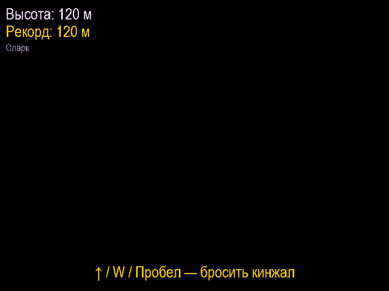
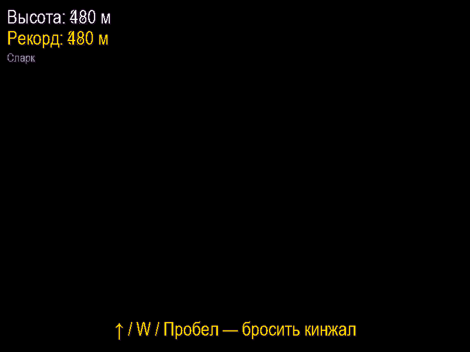
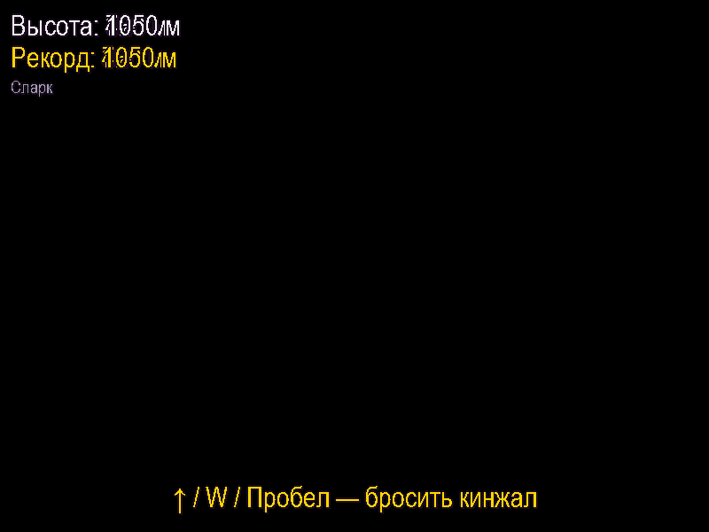
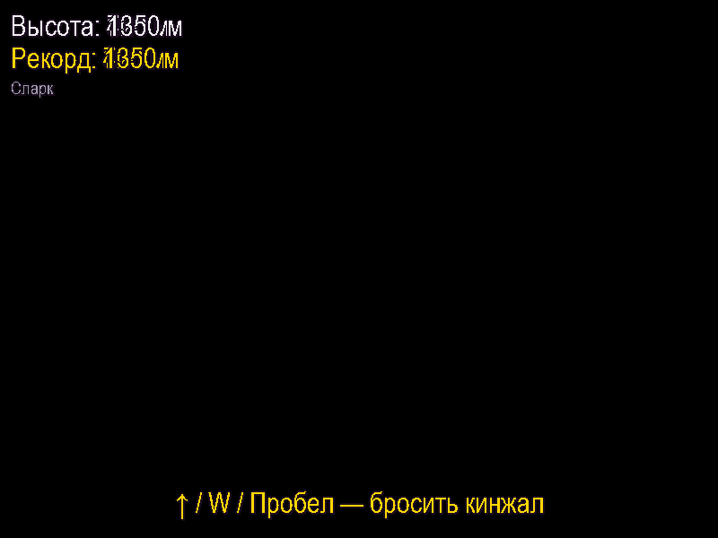

# Прыжки Сларка

Пиксельная прыгалка в стиле тёмного фэнтези: прыгайте по платформам всё выше, от долины средневекового замка
через кровавый закат и море облаков до звёздной бездны. Кидайте кинжалы во врагов и соревнуйтесь с другом
по сети — кто прыгнет выше из трёх попыток.



| Кровавый закат | Над облаками | Звёздная бездна |
|---|---|---|
|  |  |  |

## Что есть в игре

- **Четыре зоны по высоте** с плавными переходами: долина замка (0 м), кровавый закат (250 м),
  над облаками (600 м), звёздная бездна (1000 м). Фон с параллаксом: горы, замок, река и лес уезжают вниз.
- **Уровень из структур**: лестницы, мосты со скелетами, цепочки движущихся платформ, лифты, исчезающие
  платформы, грибные батуты, минные поля. Чем выше — тем сложнее.
- **Враги**: скелет-воин, каменная горгулья, проклятая мина. На скелета и горгулью можно прыгнуть сверху.
- **Кинжал**: Сларк бросает его вверх — убивает врагов и взрывает мины.
- **Бонусы**: светящийся гриб (высокий прыжок), «Крылья тьмы» (полёт), «Теневой танец» (неуязвимость).
- **Сетевая дуэль**: лобби с поиском игр в локальной сети, три попытки, разделённый экран, реванш.
  Встроенная «Проверка связи» подскажет, если мешает VPN, брандмауэр или роутер.
- **8-битная музыка** в духе старых приставок Nintendo: один длинный бесшовный трек
  (`assets/music_valley.ogg`), который играет на всех зонах. Раньше у каждой зоны была своя мелодия,
  но длинная петля оказалась лучше — музыка не прерывается на границах зон.
- **Таблица рекордов**, полноэкранный режим (F11).

## Управление

| Клавиши | Действие |
|---|---|
| ← → или A D | Двигаться |
| ↑, W или Пробел | Бросить кинжал |
| Esc | Закончить игру / выйти в меню |
| M | Выключить / включить музыку |
| F11 | Полный экран |

## Как запустить

Нужен Python 3.12 или новее (проверено на 3.14).

```bat
python -m venv .venv
.venv\Scripts\pip install -r requirements.txt
run_game.bat
```

Или вручную: `.venv\Scripts\python.exe main.py`.

### Собрать .exe

Запустите `build_exe.bat`. Игра собирается папкой `dist\SlarkJump\` (`SlarkJump.exe` + `_internal`)
и сразу упаковывается в `dist\SlarkJump-v<версия>.zip` — этот архив можно отдать другу, Python ему не нужен.
Рекорды сохраняются рядом с `.exe` в `records.json`.

Почему папкой, а не одним файлом: «однофайловый» `.exe` при запуске распаковывает себя во временную папку,
и антивирусы часто принимают это за вирус. Сборка папкой срабатывает на такую ложную тревогу гораздо реже.
Номер версии меняется в трёх местах: `build_exe.bat`, `common.py` (`VERSION`) и `tools\version_info.txt`.

### Сетевая дуэль

1. Оба игрока в одной сети (например, от одного Wi-Fi) и с **одинаковой версией** игры.
2. Один нажимает «Сетевая дуэль» → «Создать игру», второй — «Найти игру» и выбирает хоста из списка.
3. Если не находится: выключите VPN, запустите `allow_firewall.bat` (один раз, на компьютере хоста)
   и воспользуйтесь пунктом «Проверка связи».

Игра использует порты TCP 50505 (дуэль) и UDP 50506 (поиск в лобби).

## Как устроен код

| Файл | Что внутри |
|---|---|
| `main.py` | Меню, ввод имени, рекорды, экран конца игры |
| `jump_game.py` | Сама игра: физика, генерация уровня, враги, кинжалы, бонусы |
| `jump_art.py` | Графика героя, врагов, бонусов и платформ |
| `jump_background.py` | Фон: зоны, замок, солнце, облака, космос |
| `pixel_art.py` | Инструменты пиксель-арта: палитра, светотень, контуры, анимация сдвигом пикселей |
| `music.py` | Фоновая музыка: длинная петля, вкл/выкл по клавише M |
| `pygame_compat.py` | Прослойка над pygame: работает и с pygame 2, и с pygame-ce |
| `duel.py` | Сетевая дуэль: соединение, лобби, проверка связи, разделённый экран |
| `common.py` | Окно, шрифты, загрузка картинок и звуков |
| `tools/` | Подготовка спрайта героя из картинки, иконка, звуки, музыка (`make_music.py`) |

Спрайт героя собирается из картинки инструментом:

```bat
.venv\Scripts\python.exe tools\prepare_sprite.py tools\slark_source.png
```

Он убирает фон-«шахматку», восстанавливает сетку пикселей и сводит цвета к палитре.
Размер героя задаётся вторым параметром (размер «пикселя» исходной картинки, по умолчанию 5.7).

Музыка пересобирается инструментом `tools\make_music.py`: он пишет `.wav` и, если установлен
[ffmpeg](https://ffmpeg.org), сразу жмёт его в `.ogg` (во много раз легче) и удаляет `.wav` —
в репозитории и в сборке лежит только `.ogg`. Игра понимает оба формата, так что если ffmpeg нет,
`music_valley.wav` тоже будет работать.

## Об авторских правах

Это любительская фан-игра, сделанная для удовольствия. Сларк — персонаж игры Dota 2, все права на него
принадлежат Valve Corporation; игра никак не связана с Valve. Картинка героя (`tools/slark_source.png`) —
фан-арт, найденный в интернете; если вы её автор и против использования — напишите, и её заменят.
Остальная графика, звуки и музыка созданы кодом в этом репозитории.
